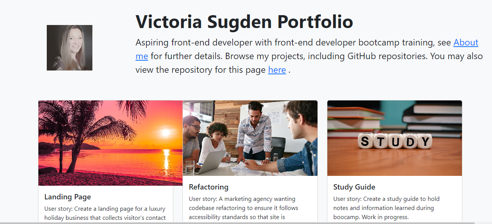
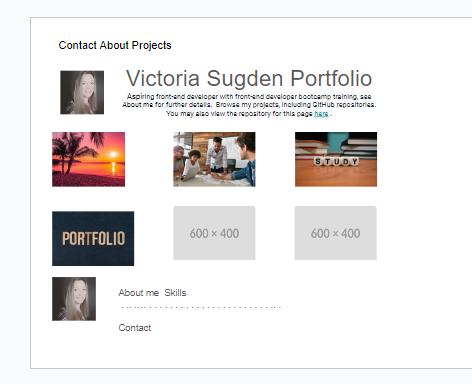

# Bootstrap Portfolio

## Overview

For this assignment, I will be building my portfolio layout using the Bootstrap CSS Framework.

## Commits

 * I will be committing often as it allows me to see how my app is progressing and gives me a point to revert to if anything goes wrong.

* I will be clear and descriptive in my commit messaging.

   The website will include the following bootstrap components:

    - A Navigation bar
    
    - A navigation menu at the top. I could use the navbar code provided in Bootstrap's documentation, or create my own navbar by applying the correct Bootstrap classes to your HTML.

      - Include links that are applicable to my  portfolio.
  
        - Links should navigate to the appropriate sections 

    - A hero section

        - A jumbotron featuring my picture, my name, and any other information I might like to include.

    - A work section

      - A section displaying my work in grid. 

        - If I need to use placeholder image use: https://placehold.co/ 

      - Use bootstrap cards for each project.

        - The description should give a brief overview of the work.

      - Each project will eventually link to my class project work!

    - A skills section

      - List out the skills I expect to learn from the bootcamp.

    - An about / contact section.

      - An "About Me" section in the same row.
    
    - A footer section.

      - All hyperlinks will have a hover effect.

      - All buttons will display a box shadow upon hover.

 My Bootstrap solution will minimize use of media queries.

 Deploy my new Bootstrap-powered portfolio to GitHub Pages.

## Screenshots

Screenshot of finished web page:

Screenshot of wireframe in Google slides:

  

Link to Google slide: https://docs.google.com/presentation/d/1ycBF_pVwrwFfczI9X7kiNpuIZ0S2OhWFudB_1FkbelU/edit?usp=sharing